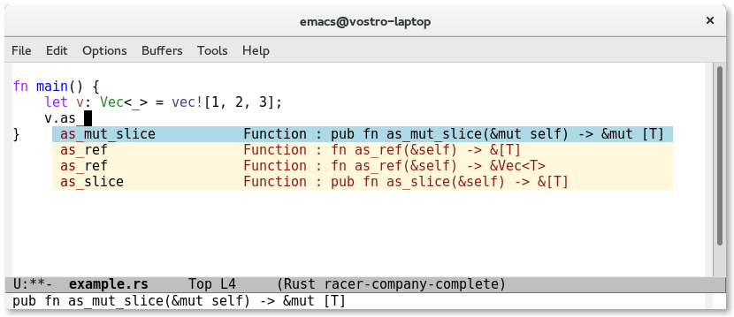

# *Racer* - code completion for [Rust](http://www.rust-lang.org/)

[](https://github.com/racer-rust/racer/actions?query=workflow%3ACI+branch%3Amaster)





*RACER* = *R*ust *A*uto-*C*omplete-*er*. A utility intended to provide Rust code completion for editors and IDEs. Maybe one day the 'er' bit will be exploring + refactoring or something.

## Installation

**NOTE**
From 2.1, racer needs **nightly rust**

### Requirements

#### Current nightly Rust

If you're using rustup, run
```
rustup toolchain add nightly
```

#### Cargo
Internally, racer calls cargo as a CLI tool, so please make sure cargo is installed

### With `cargo install`

Simply run:

```cargo +nightly install racer```

As mentioned in the command output, don't forget to add the installation directory to your `PATH`.

### From sources

1. Clone the repository: ```git clone https://github.com/racer-rust/racer.git```

2. ```cd racer; cargo +nightly build --release```.  The binary will now be in ```./target/release/racer```

3. Add the binary to your `PATH`. This can be done by moving it to a directory already in your `PATH` (i.e. `/usr/local/bin`) or by adding the `./target/release/` directory to your `PATH`

## Configuration

1. Fetch the Rust sourcecode

    1. automatically via [rustup](https://www.rustup.rs/) and run `rustup component add rust-src` in order to install the source to `$(rustc --print sysroot)/lib/rustlib/src/rust/library` (or `$(rustc --print sysroot)/lib/rustlib/src/rust/src` in older toolchains). Rustup will keep the sources in sync with the toolchain if you run `rustup update`.

    2. manually from git: https://github.com/rust-lang/rust

    **Note**

     If you want to use `racer` with multiple release channels (Rust has 3 release channels: `stable`, `beta` and `nightly`), you have to also download Rust source code for each release channel you install.

    e.g. (rustup case) Add a nightly toolchain build and install nightly sources too

    `rustup toolchain add nightly`

    `rustup component add rust-src`

2. (Optional) Set `RUST_SRC_PATH` environment variable to point to the 'src' dir in the Rust source installation
   e.g. `% export RUST_SRC_PATH=$(rustc --print sysroot)/lib/rustlib/src/rust/library` or `% export RUST_SRC_PATH="$(rustc --print sysroot)/lib/rustlib/src/rust/src"` (older)

   It's recommended to set `RUST_SRC_PATH` for speed up, but racer detects it automatically if you don't set it.

3. Test on the command line:

   `racer complete std::io::B `  (should show some completions)

**Note**

To complete names in external crates, Racer needs `Cargo.lock`.
So, when you add a dependency in your `Cargo.toml`, you have to run a build command
such as `cargo build` or `cargo test`, to get completions.

## Editors/IDEs Supported

### RLS

Racer is used as a static library in [RLS](https://github.com/rust-lang-nursery/rls)

### Eclipse integration

Racer can be used with Eclipse through the use of [RustDT](https://github.com/RustDT/RustDT). (User guide is [linked](http://rustdt.github.io/) in repo description)

### Emacs integration

Emacs integration has been moved to a separate project: [emacs-racer](https://github.com/racer-rust/emacs-racer).

### Gedit integration

Gedit integration can be found [here](https://github.com/isamert/gracer).

### Builder integration

Gnome Builder integration can be found [here](https://github.com/deikatsuo/bracer)

### Kate integration

The Kate community maintains a [plugin](https://cgit.kde.org/kate.git/tree/addons/rustcompletion). It is bundled with recent releases of Kate (tested with 16.08 - read more [here](https://blogs.kde.org/2015/05/22/updates-kates-rust-plugin-syntax-highlighting-and-rust-source-mime-type)).

1. Enable 'Rust code completion' in the plugin list in the Kate config dialog;

2. On the new 'Rust code completion' dialog page, make sure 'Racer command' and 'Rust source tree location' are set correctly.

### Sublime Text integration

The Sublime Text community maintains some packages that integrates Racer
* [RustAutoComplete](https://github.com/defuz/RustAutoComplete) that offers auto completion and goto definition.
* [AnacondaRUST](https://github.com/DamnWidget/anaconda_rust) from the [anaconda](http://github.com/DamnWidget/anaconda) plugins family that offers auto completion, goto definition and show documentation

### Vim integration

Vim integration has been moved to a separate project: [vim-racer](https://github.com/racer-rust/vim-racer).

### Visual Studio Code extension

Racer recommends the official [`Rust (rls)` extension](https://github.com/rust-lang-nursery/rls-vscode) based on RLS, which uses Racer for completion.

### Atom integration

You can find the racer package for Atom [here](https://atom.io/packages/autocomplete-racer)

### Kakoune integration

[Kakoune](https://github.com/mawww/kakoune) comes with a builtin integration for racer auto completion.
